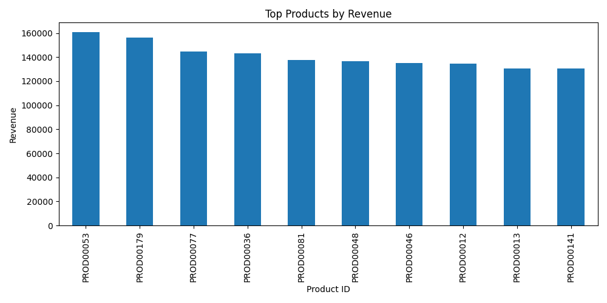
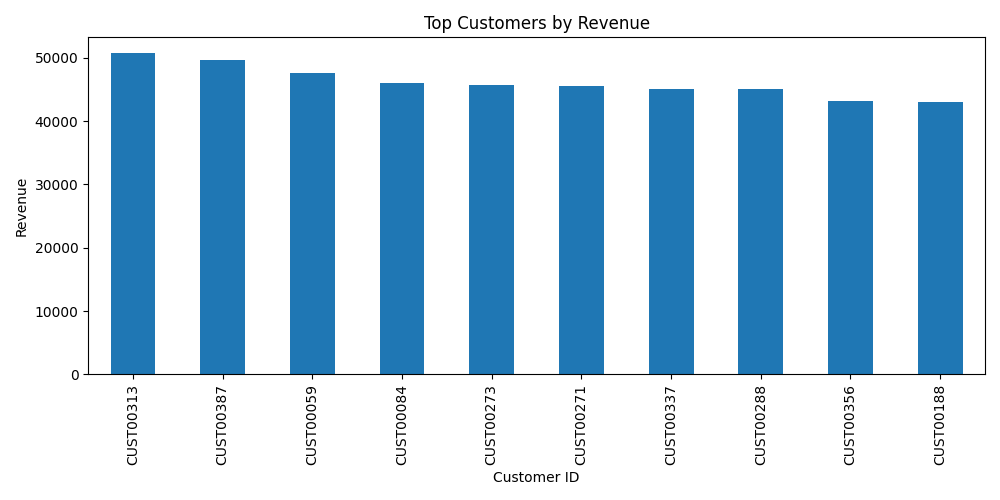
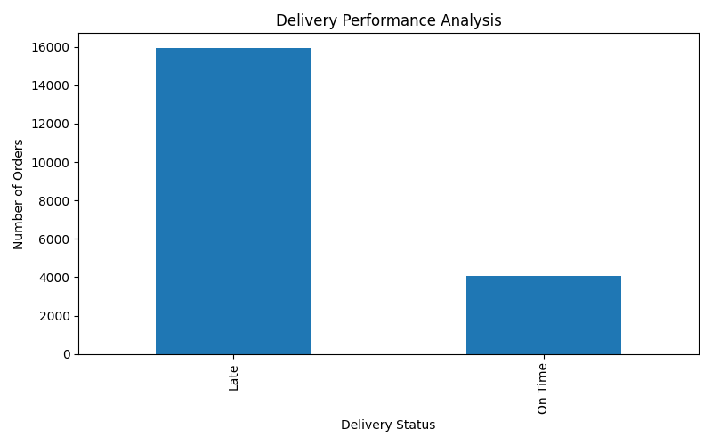
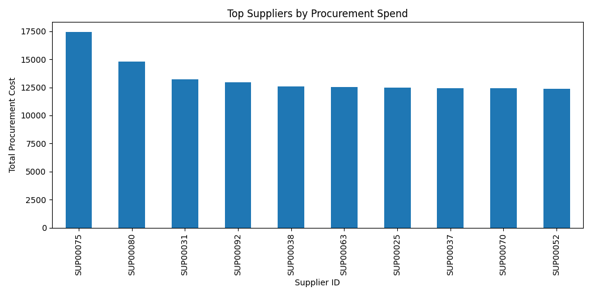
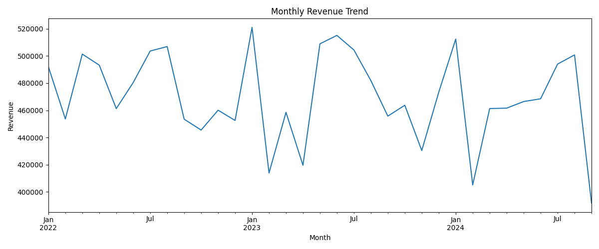
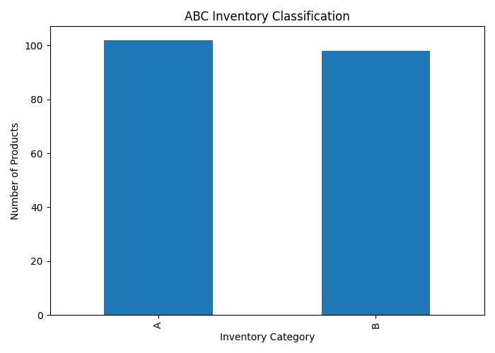

# Supply Chain Operations & Fulfillment Analytics

## Project Overview

This project analyzes operational supply chain and fulfillment data to identify demand patterns, customer purchasing behavior, procurement activity, delivery performance, and inventory prioritization opportunities.

Using SQL and Python, the analysis focuses on operational efficiency, procurement visibility, fulfillment trends, demand concentration, and inventory classification to support data-driven supply chain decision-making.

The project simulates a real-world operational analytics workflow by combining structured SQL analysis with Python-based business analytics and visualization.

---

## Business Objectives

- Analyze operational demand trends and customer purchasing behavior
- Identify high-revenue products and customer concentration patterns
- Evaluate supplier procurement activity and operational dependency
- Monitor delivery performance and fulfillment efficiency
- Support inventory prioritization using ABC classification analysis
- Generate operational insights to improve supply chain performance

---

## Tools & Technologies

- SQL
- Python
- Pandas
- Matplotlib
- Git & GitHub

---

## Project Structure

```text
Supply-Chain-Operations-Analytics/
│
├── data/
│   ├── sales_orders.csv
│   ├── procurement_orders.csv
│   ├── product_master.csv
│   ├── customer_master.csv
│   └── supplier_master.csv
│
├── sql/
│   └── supply_chain_operational_analysis.sql
│
├── python/
│   └── supply_chain_analysis.py
│
├── images/
│   ├── top_products.png
│   ├── top_customers.png
│   ├── delivery_performance.png
│   ├── top_suppliers.png
│   ├── monthly_revenue_trend.png
│   └── abc_inventory.png
│
└── README.md
```

---

## SQL Analysis Areas

The SQL analysis focuses on operational and fulfillment analytics across multiple business functions, including:

- Data validation and quality assessment
- Customer order analysis
- Product demand analysis
- Operational KPI reporting
- Delivery and fulfillment analysis
- Procurement and supplier analysis
- ABC inventory classification
- Demand segmentation
- Window function and ranking analysis
- Common Table Expressions (CTEs)
- Operational trend analysis

---

## Python Operational Analysis

The Python analysis script extends the SQL analysis through operational KPI reporting, business analytics, and data visualization, including:

- Operational KPI summaries
- Product revenue analysis
- Customer revenue analysis
- Delivery performance analysis
- Supplier procurement analysis
- Monthly operational trend analysis
- ABC inventory classification
- Business insight generation

---

## Operational KPI Summary

- Total Orders: 20,000
- Total Revenue: 15.5M+
- Total Customers: 500
- Total Products: 200

---

## Key Operational Insights

- A concentrated group of products generated the majority of operational revenue
- Customer demand showed concentration among high-value accounts
- Procurement activity highlighted operational dependency on major suppliers
- Delivery analysis identified fulfillment performance trends across operations
- ABC classification identified high-priority inventory categories requiring closer monitoring
- Monthly revenue trends revealed fluctuations in operational demand over time

---

## Sample Visualizations

### Product Revenue Analysis



---

### Customer Revenue Analysis



---

### Delivery Performance Analysis



---

### Supplier Procurement Analysis



---

### Monthly Operational Trend Analysis



---

### ABC Inventory Classification



---

## Key Skills Demonstrated

- Operational analytics
- Supply chain analytics
- SQL querying and analytical functions
- Data aggregation and KPI reporting
- Python data analysis
- Business data visualization
- Inventory classification analysis
- Procurement analytics
- Fulfillment analysis
- Business insight generation

---

## Future Enhancements

- Demand forecasting and trend prediction
- Supplier risk scoring models
- Inventory optimization analysis
- Logistics and transportation analysis
- Interactive operational dashboards
- Automated reporting workflows
- Predictive supply chain analytics
